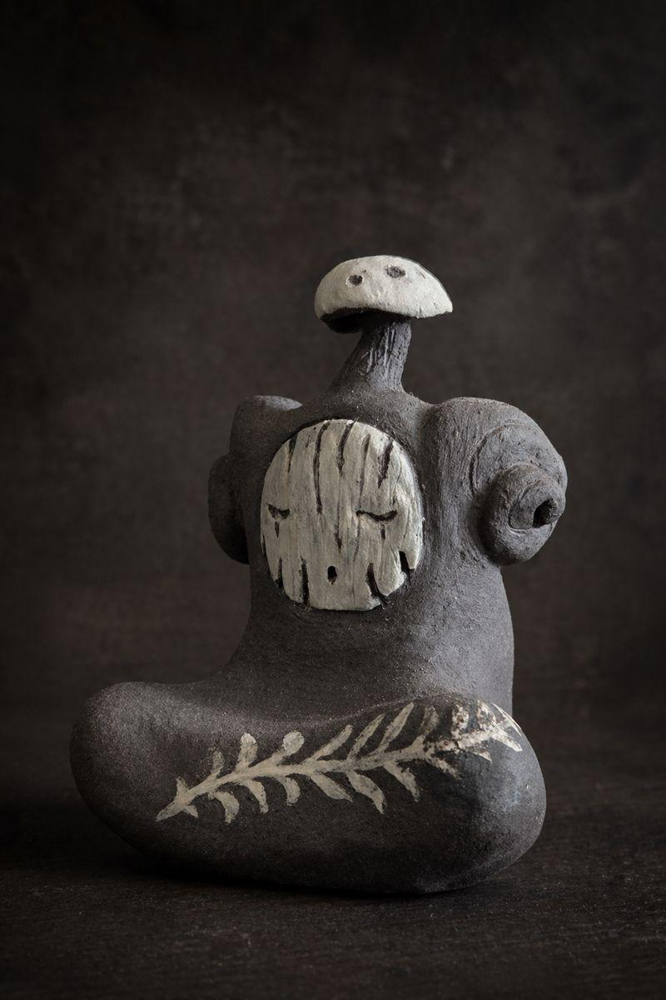

# Dark Saga Art — общий контент для всех макетов

Все 10 макетов используют ОДИН и тот же контент и фото ниже. Файлы лежат в `designs/`,
поэтому пути к ассетам относительные: `../assets/...`.

## Глобальные требования к каждому макету
- Самодостаточный один .html: весь CSS и JS — inline. Google Fonts можно. БЕЗ других внешних
  библиотек (никакого CDN three.js/GSAP) — должно открываться по file://.
- Ультра-современно, но поддерживает тёмно-сказочную атмосферу handmade-керамики и арт-кукол.
  НИКАКОГО футуризма, неона, киберпанка, Y2K, ретро, скевоморфизма.
- Адаптив: на мобайле (<=768px) шапка сворачивается (гамбургер или компактно), карточки 1–2 в ряд.
- Сохранить ВСЕ разделы: Hero → Tea Pets → Art Dolls (3 серии) → Reviews → Adopt/Buy → About → Footer.
- Изображения карточек квадратные через object-fit: cover. Реальные фото — ниже.
- Англоязычный сайт (контент на английском), как сейчас.

## Бренд
- Название: Dark Saga Art. Лого: `../assets/logos/logo-brand.png`.
- Hero tagline: "Handmade tea companions & art dolls"
- Hero title: "A Modern Bestiary of Strange Soulmates"
- Hero desc: "Collectible characters with tangible stories. Handcrafted with zero molds or copies."
- CTA: Etsy → https://www.etsy.com/shop/DarkSagaArt (target=_blank). Instagram → https://www.instagram.com/dark_saga_art
- Hero вторичная кнопка: "Explore Collections" (ведёт к #tea-pets).

## Раздел Tea Pets
Подзаголовок: "Tea Spirits Collection" — "Small beings with huge personality. Pour tea over them and the clay matures over time."
Карточки (имя | описание | фото):
1. Bracken | A calm watcher who notices everything. | ../assets/tea-pets/tea-pet-02.jpg
2. Vesper | Calm, brooding, and prefers night times. | ../assets/tea-pets/tea-pet-03.jpg
3. Hob | Tidy, practical, and responsible. | ../assets/tea-pets/tea-pet-04.jpg
4. Kovu | Goes with the flow, never gets stuck. | ../assets/tea-pets/tea-pet-05.jpg
5. Mura | Rooted strength, peace of cold woods. | ../assets/tea-pets/tea-pet-06.jpg
6. Solas | A warm soul who hums forgotten songs. | ../assets/tea-pets/tea-pet-07.jpg
7. Pio | Gentle, kind, and easy to be around. | ../assets/tea-pets/tea-pet-08.jpg
8. Kitsune | Cunning, mischievous and restless. | ../assets/tea-pets/tea-pet-09.jpg
9. Pip the Silent Perch | Shy, gentle, and happiest in silence. | ../assets/tea-pets/tea-pet-10.jpg
10. Napscale Wyrmling | Cozy, lazy, and devoted to napping. | ../assets/tea-pets/tea-pet-11.jpg
11. Runehorn Sentinel | Steady, grounded, and quietly reassuring. | ../assets/tea-pets/tea-pet-12.jpg
12. Six-Eyed Spirit Bird | Snarky, watchful, and full of attitude. | ../assets/tea-pets/tea-pet-13.jpg
13. Master of the Forest | Patient, watchful, and calm as old stone. | ../assets/tea-pets/tea-pet-14.jpg
14. Marl | Observant, tender, devoted to beauty. | ../assets/tea-pets/tea-pet-15.jpg
15. Koda the Root-Dreamer | Patient, nurturing, and endlessly wise. | ../assets/tea-pets/tea-pet-16.jpg
16. Sea Dragon | Graceful, untamed, and unstoppable. | ../assets/tea-pets/tea-pet-17.jpg

## Раздел Art Dolls (3 серии)
### Series 1 — Bastards of the Fall (логотип ../assets/logos/logo-bastards.png)
Подзаголовок: "Creatures born from dark, decadent fantasy — inhabitants of forgotten realms."
1. Iron Harlequin (Echo of the Throne) | Echo of the Throne, defender of his Queen. | ../assets/bastards/bastards-01.jpg
2. Queen of Ashes | A fallen queen who traded lace for steel. | ../assets/bastards/bastards-02.jpg
3. Gentleman of the Lower City | A charming thief of the gas-lit lower city. | ../assets/urban/urban-04.jpg
4. The Librarian | Keeper of forgotten books and secrets. | ../assets/bastards/bastards-03.jpg

### Series 2 — Urban Misfits (логотип ../assets/logos/logo-urban.png)
Подзаголовок: "Contemporary buddies shaped by modern cities. Slightly broken, slightly surreal."
1. Master of the Forest | An old forest god ruling the city's routes. | ../assets/urban/urban-02.jpg
2. The Dreamer | A shy street artist painting empty nights. | ../assets/urban/urban-03.jpg
3. The Observer | A silent elf watching the loud city go by. | ../assets/urban/urban-05.jpg
4. The Garden Snail | Cheerful, dreamy, and in no rush at all. | ../assets/urban/urban-06.jpg

### Series 3 — Spores (логотип ../assets/logos/logo-spores.png)
Подзаголовок: "Small, portable beings: minimal in form, maximal in personality. Pocket-sized."
1. Skyline Nomad | A rooftop spirit chasing wind and freedom. | ../assets/spores/spores-01.jpg
2. The Roastery Kodama | A tiny spirit fueled by specialty coffee. | ../assets/spores/spores-02.jpg

## Reviews (Collector Testimonials)
1. "Absolutely gorgeous piece very well crafted and packed, amazing communication. Extra tea coin and little dragon extra are a very cute addition, thank you!" — Etsy Buyer (via Etsy)
2. "Fantastic addition to my tea set. Svetlana's customer service was professional and friendly. Shipping was quick and my package arrived safe and sound." — Adam (via Etsy)
3. "My tea pet was shipped super fast, it's my first and I couldn't have picked a better tea pet, Kovu is amazing! The packaging was super nice too!" — Micheale (via Etsy)

## Adopt / Buy section
Heading: "Adopt a Companion"
Text: "What you see here is only a small corner of the menagerie. The rest of the creatures, every odd soul still waiting for its human, have wandered over to our Etsy shop. That is where they find their way home, with secure checkout and shipping."
Buttons: "Adopt a Companion" (Etsy), "Follow on Instagram" (IG).
Note: "*You will be redirected to our Etsy shop to complete the adoption."

## About (Behind the art)
Heading: "Behind the art"
P1: "I believe that in a world rapidly spinning into digital abstraction, we desperately need a sense of grounding. We need something with physical weight, rich texture, and a distinct heartbeat. That is why I create these strange companions."
P2: "Every entity at Dark Saga Art is brought to life by hand using clay, textiles, and mixed media. There are no molds and no replications. My characters can be odd, whimsical, cute, or arrogant, but they are always deeply authentic."
P3: "Dark Saga Art is for those who appreciate beauty with a sharp edge, and believe that surrounding yourself with unique objects helps your inner world unfold. If that is you, welcome!"
Closer (italic, accent): "It seems you've found your crowd."

## Footer
"Dark Saga Art" + small print "Handmade in small batches. © 2026 Dark Saga Art." + Etsy & Instagram links. Email optional: hello@darksaga.art (placeholder, can include).

## Hero image / section previews (можно использовать как фоны/баннеры)
- `../assets/hero.png`
- `../assets/tea-pets-preview.png`
- `../assets/art-dolls-preview.png`

---

# ROUND 3 — для макетов design-21..25 (раунд 2 / 11–20 ОТМЕНЁН)

Базовая эстетика: тёмная, атмосферная, ультра-современная. Без футуризма/неона/ретро.
Переиспользуй ИМЕННО проверенные реализации ниже (адаптируя только цвет акцента под палитру своего макета).

## A. Карточки галерей — сетка фото + описание ПО НАВЕДЕНИЮ (точно как вариант 10)
Сетка квадратных фото. По hover: фото зумится/светлеет, поднимается тёмный градиент, проявляется подпись (имя + курсивное описание) и тонкая акцентная линия снизу. CSS-референс (замени var(--ember) на акцент макета):
```css
.cards-grid { display: grid; grid-template-columns: repeat(4, 1fr); gap: 2px; }
.card { position: relative; aspect-ratio: 1/1; overflow: hidden; background:#16161a; cursor:pointer;
  opacity:0; transform: translateY(20px); transition: opacity .6s, transform .6s; }
.card.visible { opacity:1; transform: translateY(0); }
.card-img { width:100%; height:100%; object-fit:cover; transition: transform .6s, filter .4s;
  filter: saturate(.75) brightness(.9); }
.card:hover .card-img { transform: scale(1.06); filter: saturate(1) brightness(1); }
.card-overlay { position:absolute; inset:0; opacity:0; transition: opacity .4s;
  background: linear-gradient(to top, rgba(8,8,10,.92) 0%, rgba(8,8,10,.3) 50%, transparent 100%); }
.card:hover .card-overlay { opacity:1; }
.card-info { position:absolute; left:0; right:0; bottom:0; padding:24px 20px 20px; opacity:0;
  transform: translateY(8px); transition: transform .4s, opacity .4s; }
.card:hover .card-info { opacity:1; transform: translateY(0); }
.card-name { font-size:13px; font-weight:600; letter-spacing:.08em; margin-bottom:6px; }
.card-desc { font-style:italic; font-size:14px; opacity:.8; line-height:1.4; }
.card-line { position:absolute; bottom:0; left:0; right:0; height:2px; background: ACCENT;
  transform: scaleX(0); transform-origin:left; transition: transform .4s; }
.card:hover .card-line { transform: scaleX(1); }
```
HTML карточки:
```html
<article class="card">
  <div class="card-overlay"></div>
  <div class="card-info"><div class="card-name">BRACKEN</div>
    <div class="card-desc">A calm watcher who notices everything.</div></div>
  <div class="card-line"></div></article>
```
JS: IntersectionObserver добавляет `.visible` карточкам при появлении (со stagger-задержкой).

## B. Курсор-фонарик — ТЁПЛЫЙ ЖЁЛТЫЙ (точно как вариант 6). Во всех 5 макетах держи именно тёплый золотой цвет.
```css
@media (hover:hover) and (pointer:fine) { body { cursor:none; } }
#cursor-glow { position:fixed; width:400px; height:400px; border-radius:50%; pointer-events:none;
  z-index:9999; transform: translate(-50%,-50%); transition: opacity .3s;
  background: radial-gradient(circle, rgba(201,162,90,0.10) 0%, transparent 70%); }
#cursor-dot { position:fixed; width:8px; height:8px; border-radius:50%; background:#c9a25a;
  pointer-events:none; z-index:10000; transform: translate(-50%,-50%); opacity:.7; }
@media (hover:none),(pointer:coarse) { #cursor-glow,#cursor-dot { display:none; } body{cursor:auto;} }
```
HTML: `<div id="cursor-glow"></div><div id="cursor-dot"></div>` (перед </body>).
JS: `const g=cursor-glow,d=cursor-dot; document.addEventListener('mousemove',e=>{g.style.left=d.style.left=e.clientX+'px'; g.style.top=d.style.top=e.clientY+'px';});`

## C. Hero — КОНЦЕПЦИЯ РОВНО как вариант 5 + смена объектов по клику (лёгкая анимация)
Концепция блока строго как в варианте 5: один объект на «пьедестале» по центру (тень-диск под ним, тонкая рамка вокруг фото, мягкий idle-наклон + параллакс от движения мыши), вокруг — музейные подписи (spec): Name, Material: Ceramic, Series, One-of-a-Kind.
НОВОЕ (то, чего хотела заказчица): несколько объектов (4–5: tea-pet-05, 14, 16, 17, 09). Под/рядом с пьедесталом — компактный ряд мини-миниатюр этих объектов. По КЛИКУ по миниатюре выбранный объект ПЛАВНО и АККУРАТНО перетекает в центр пьедестала (лёгкая анимация: cross-fade + небольшой scale/slide, ~0.4–0.6s), подписи (Name/Series) обновляются под новый объект, активная миниатюра подсвечивается. БЕЗ топорных «вееров/стопок». Только vanilla JS.
Turntable CSS-референс:
```css
.turntable-stage { position:relative; width:min(440px,42vw); aspect-ratio:1; margin:0 auto;
  display:flex; align-items:center; justify-content:center; }
.turntable-stage::after { content:''; position:absolute; bottom:4%; left:50%; transform:translateX(-50%);
  width:64%; height:20px; border-radius:50%; pointer-events:none;
  background: radial-gradient(ellipse, rgba(0,0,0,.7) 0%, transparent 75%); }
.turntable-img { width:78%; aspect-ratio:1; object-fit:cover; border-radius:2px;
  outline:1px solid rgba(255,255,255,.18); outline-offset:4px;
  animation: idleTilt 7s ease-in-out infinite; transition: opacity .5s, transform .5s; }
@keyframes idleTilt { 0%,100%{transform:rotateX(0) rotateY(0) translateY(0);}
  50%{transform:rotateX(0deg) rotateY(-1.5deg) translateY(-6px);} }
.thumb { width:64px; height:64px; object-fit:cover; opacity:.5; cursor:pointer; border:1px solid transparent;
  transition:.3s; } .thumb:hover,.thumb.active { opacity:1; border-color:ACCENT; }
```

## D. Прочее (как раньше)
- Reviews-секция: заголовок **«Collector Voices»**, описание ровно: "Words from those who have welcomed a strange companion into their home."
- Плотный ритм, БЕЗ огромных пустот (padding секций ~4–5rem, hero без зияющей пустоты сверху).
- Заголовки секций — чисто: kicker (мелкий letterspaced) + заголовок. НЕ выносить картинку над заголовком.
- Все разделы (Hero → Tea Pets 16 → Art Dolls 3 серии → Collector Voices → Adopt → About → Footer), адаптив с рабочей мобильной шапкой, самодостаточный файл, пути `../assets/...`.

Каждый из 5 макетов отличается ТОЛЬКО палитрой + типографикой + настроением (см. бриф агента). Базовые механики (A/B/C/D) — одинаковые и качественные.
